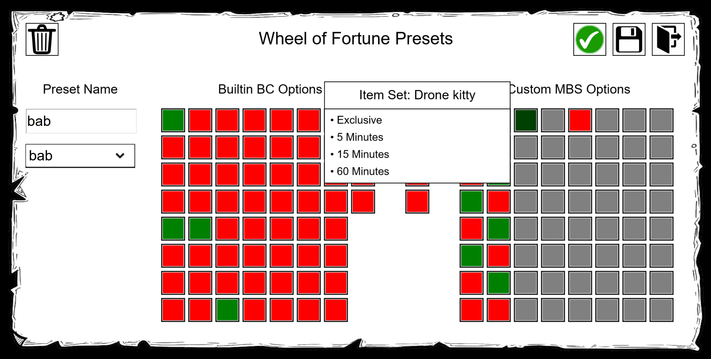
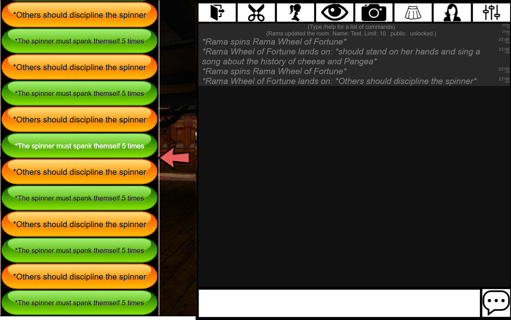
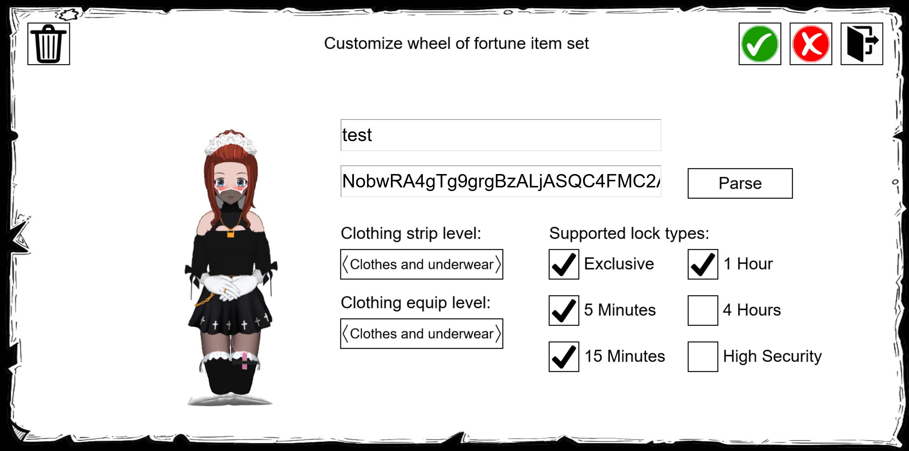

# MBS Changelog

## v1.7.24
* Fix extended crafting descriptions sometimes dropping the last character

## v1.7.23
* Add a missing extended crafted item description check to `CraftingModeSet`

## v1.7.22
* Include the new BC EU host URL in the MBS user script
* Add the ability to create crafted item description with up to 398 "simple" characters (_i.e._ extended ASCII).
  This functionality can be enabled under `Preferences` > `MBS Settings`.
  Note that these descriptions will only be legible for MBS users.

## v1.7.21
* Drop R106 support
* Update reported R107 items

## v1.7.20
* Add R107Beta1 support
* Drop R105 support

## v1.7.19
* Add R106Beta1 support
* Show the MBS changelog in the chat
* Add the `/mbschangelog` chat command to show the latest MBS changelog (default behavior) or alternatively the changelog of a specific version or version range.

## v1.7.18
* Backport two bug fixes:
    - [BondageProjects/Bondage-College#5108](https://gitgud.io/BondageProjects/Bondage-College/-/merge_requests/5108): Fix number inputs being clamped to zero if no min/max is specified on the input element
    - [BondageProjects/Bondage-College#5109](https://gitgud.io/BondageProjects/Bondage-College/-/merge_requests/5109): Fix item visibility settings not saving

## v1.7.17
* Drop R104 support

## v1.7.16
* Add R105Beta1 support

## v1.7.15
* Allow search inputs to provide suggestions
    - Backports [BondageProjects/Bondage-College#5065](https://gitgud.io/BondageProjects/Bondage-College/-/merge_requests/5065): Offer search suggestions when typing into search bars

## v1.7.14
* Switch a few remaining units from viewport- to dynamic viewport
* Chat room separator tweaks (xref [BondageProjects/Bondage-College#5063](https://gitgud.io/BondageProjects/Bondage-College/-/merge_requests/5063): Various minor chat room separator adjustments):
    - Fix the spurious chat room separator transparency when in sens dep
    - Ensure that the chat room separator buttons are unfocused on mobile after a click
    - Ensure that sending a message or action scrolls the chat area to the bottom

## v1.7.13
* New improvements to the chat room separator
* Backport a pose-related bug fix
    - [BondageProjects/Bondage-College#5059](https://gitgud.io/BondageProjects/Bondage-College/-/merge_requests/5059): Fix the freeze effect accidentally limiting upper body changes

## v1.7.12
* Backport PR 5508 - Make the chat room separator much more fancier
    - [BondageProjects/Bondage-College#5058](https://gitgud.io/BondageProjects/Bondage-College/-/merge_requests/5058): Make the chat room separator much more fancier

## v1.7.11
* Fix another crash in the fortune wheel command screen

## v1.7.10
* Fix a crash in the fortune wheel command screen

## v1.7.9
* Use a hook for patching `Layering._ApplyAssetPriority`

## v1.7.8
* Backport two R105 bug fixes
    - [BondageProjects/Bondage-College#5052](https://gitgud.io/BondageProjects/Bondage-College/-/merge_requests/5052): fix `PreferenceSubscreenExtensionsClear()` when the optional unload function is undefined
    - [BondageProjects/Bondage-College#5055](https://gitgud.io/BondageProjects/Bondage-College/-/merge_requests/5055): Disable layering for locked items that one cannot unlock

## v1.7.7
* Drop BC R103 support
* Fix the screen shape not being passed on to the fortune wheel command screen

## v1.7.6
* Fix the R104 alignment of the item version filter

## v1.7.4
* Switch from viewport- to dynamic viewport units. This should provide a more consistent UI positioning on mobile.
* Add BC R104Beta1 support

## v1.7.3
* Fix a race condition related to the alternate garbling initialization

## v1.7.2
* Fix the shop not showing newly released assets

## v1.7.1
* Improve button alignment in the wheel of fortune item set menu
* Use custom `text`-based inputs (rather than `time`-based) for the wheel of fortune timers;
  fixes the odd time-offsets and AM/PM markers occasionally observed.

## v1.7.0
* Increment the MBS API to version 1.4:
    - Relicense the `mbs.css` API under terms of LPGL-v3

## v1.6.3
* Drop support for BC R102
* Fix the save-condition being broken for the fortune wheel commands screen

## v1.6.2
* Update for BC R103Beta2
* Add a safeguard for loading MBS while the `WheelFortuneCustomize` screen is open
* Remote-fetch the alternative garbling JSON data rather than directly vendoring it (again...)
* Fix various OOC-related issues related to alternative garbling
* Add the option to vary the (alternative) garbling strength per syllable
* Switch from the en_UK phonetic data to the larger en_US dataset

## v1.6.1
* Fix the garbling JSON data failing to load

## v1.6.0
* Experimental: Add an alternative form of more phonetically-acurate garbling based on Cordelia Mist's [Dalamud-GagSpeak](https://github.com/CordeliaMist/Dalamud-GagSpeak).
  Note that the alternative garbling is disabled by default.
* Add support for BC R103Beta1

## v1.5.0
* Use DOM elements for all remaining MBS screens, wrapping up the DOM-ification
* Remove a few redundant functions and replace the with lodash equivalents
* Reduce the tooltip overlap in the wheel preset screen and improve the tooltip standardization
* Further centralize the CSS styling
* Add safeguards for loading MBS while the preference- or wheel screen is open
* Increment the MBS API to version 1.3:
    - Add the new `mbs.css` namespace, which contains functions modifying MBS's style sheets.

## v1.4.7
* Fix the MBS settings menu sometimes requiring two clicks to exit
* Fix the MBS settings menu locking being incorrectly locked when restrained

## v1.4.6
* Use DOM elements for the MBS preference screens
* Bump the BC mod SDK to 1.2.0

## v1.4.5
* Remove MBS's dedicated "show new item screen" buttons when in R103
* Rewrite the MBS fortune wheel preset screen using DOM elements

## v1.4.4
* Fix the broken exit button image in the MBS wheel of fortune selection menu
* Rewrite the MBS fortune wheel item set screen using DOM elements

## v1.4.3
* Remove the the fortune wheel option hiding checkbox
* Fix the [BondageProjects/Bondage-College#4900](https://gitgud.io/BondageProjects/Bondage-College/-/merge_requests/4900) backport not hiding owner/lovers/family-locked items when required
* Rewrite the MBS fortune wheel selection screen using DOM elements; add a scroll bar
* Fix spurious MBS warnings about duplicate crafts

## v1.4.2
* Drop support for BCR101
* Fix the FUSAM button not disappearing when accessing the SHOP via the MBS preferences menu
* Backport one BC R103 change to R102:
    - [BondageProjects/Bondage-College#4900](https://gitgud.io/BondageProjects/Bondage-College/-/merge_requests/4900): Optimize the handling of crafted items in `DialogInventoryBuild`

## v1.4.1
* Fix unconditional accessing of a BC R102 variable

## v1.4.0
* Increment the MBS API to version 1.2:
    - Guarantee that the `mbs.getDebug()` output strings are JSON-safe
    - Provide better documentation regarding when features were added to the API
* Add the ability to import & export MBS settings
* Send a beep to the player if errors are encountered while initializing MBS settings
* Add support for BC R102
* Deprecate MBS' custom entry points for the Show New Items menu, all of which will be removed in R103.
  Once R102 is live (or its beta), you can use the Club Shop button in the main hall or the `/shop` chat command instead.

## v1.3.7
* Minor UI adjustments in the wheel of fortune screens
* Add the option to change an items color in the show new items menu
* Drop support for BC R100

## v1.3.6
* Do not display the wheel storage size for non-player characters
* Fix the reported index for entries in the wheel customization menu
* Fix the show now item buy menu failing to update for items with no buygroup
* Misc minor changes to how the data storage size is reported

## v1.3.5
* Refactor the logic for checking whether BC is properly loaded or not
* Re-enable the storing of crafted item descriptions in the wheel of fortune, reverting their previous removal in MBS v0.6.22
* Add checks to ensure that MBS does not exceed the 180 KB storage limit for its shared settings, exceeding of which can cause crashes and unstable behavior in BC

## v1.3.4
* Add R101Beta2 support; no support for Beta1 will be added
* Let the Show New Items menu display whether the player has F-/M-only shop items enabled
* Bump the MBS build target from ES2020 to ES2021

## v1.3.3
* Backport three BC R101 fixes to R100 (and fixed the KD one from MBS v1.3.2):
    - [BondageProjects/Bondage-College#4777](https://gitgud.io/BondageProjects/Bondage-College/-/merge_requests/4777): Fix eye colour reset on expression clear
    - [BondageProjects/Bondage-College#4779](https://gitgud.io/BondageProjects/Bondage-College/-/merge_requests/4779): Fix `Item.Property` not always properly initializing in KD
    - [BondageProjects/Bondage-College#4780](https://gitgud.io/BondageProjects/Bondage-College/-/merge_requests/4780): Fix the futuristic harness ball gag auto-inflation triggering validation

## v1.3.2
* Add the ability to buy items from the Show New Items menu
* Add safeguards in the MBS API for checking whether MBS is fully loaded already
* Fix the new item preview refreshing to the wrong outfit
* Ensure that the Show New Items menu respect the players `HideShopItems` setting

## v1.3.1
* Add a duration-tooltip for the builtin BC wheel options in the preset config screen
* Add extended item screen support to the Show New Item menu
* Allow chatroom backgrounds to show in the Show New Item menu

## v1.3.0
* Ensure that the Show New Item preview does not remove new items when switching clothing mode
* Restructure the MBS files and directories
* Add a new screen for storing wheel of fortune option presets

## v1.2.2
* Fix a the Show New Item menu preview again only partially resetting

## v1.2.1
* Fix a the Show New Item menu preview only partially resetting
* Fix a crash when paginating in the Show New Item menu
* Add a button the to MBS preference screen for accessing the Show New Item menu

## v1.2.0
* Add a new button in the main hallway for showing all new items added in the current version (beta or otherwise):

## v1.1.7
* Add R100Beta1 support
* Backport two BC R100Beta2 fixes to R100Beta1:
    - [BondageProjects/Bondage-College#4740](https://gitgud.io/BondageProjects/Bondage-College/-/merge_requests/4740): Fix `PreferenceArousalSettingsValidate` calling the wrong cloning function
    - [BondageProjects/Bondage-College#4741](https://gitgud.io/BondageProjects/Bondage-College/-/merge_requests/4741): Ensure that the `GameVersion` validation modifies the players game version when required

## v1.1.6
* Drop BC R98 support

## v1.1.5
* Fix a faulty `TypeRecord` check

## v1.1.4
* Add R99Beta1 support
* Add a dedicated MBS logger.
* Increment the MBS API to version 1.1:
    - Expose `mbs.getDebug()` to the API
* Backport one BC R99Beta2 fix to R99Beta1:
    - [BondageProjects/Bondage-College#4662](https://gitgud.io/BondageProjects/Bondage-College/-/merge_requests/4662): Various `TypeRecord`-related fixes

## v1.1.3
* Fix (non-shared) MBS settings not saving

## v1.1.1
* Misc CI updates
* Remove the last `OnlineSettings` remnants
* Provide more console output upon encountering errors related to MBS extra crafting items
* Register an MBS debugger to FUSAM
* Backport one BC R99 fix:
    - [BondageProjects/Bondage-College#4610](https://gitgud.io/BondageProjects/Bondage-College/-/merge_requests/4610): Remove `InventoryAllow` checks from `DialogMenuButtonBuild()`

## v1.1.0
* Add the ability to specify weights for wheel of fortune options
* Move `OnlineSettings` to `ExtensionSettings`. Note that this does not affect data stored in `OnlineSharedSettings`.
* Append the MBS version with the git tag on non-release commits
* Backport three BC R99 fixes:
    - [BondageProjects/Bondage-College#4602](https://gitgud.io/BondageProjects/Bondage-College/-/merge_requests/4602): Allow to specify `Top`/`Left` on a pose-by-pose basis
    - [BondageProjects/Bondage-College#4604](https://gitgud.io/BondageProjects/Bondage-College/-/merge_requests/4604): Fix the futuristic gag auto inflation tripping up on the `Init` validation
    - [BondageProjects/Bondage-College#4605](https://gitgud.io/BondageProjects/Bondage-College/-/merge_requests/4605): Properly implement Advanced vibrator mode support for the vibrating item `Init` validation

## v1.0.1
* Drop support for BC R98
* Backport one BC R98 hotfix:
    - [BondageProjects/Bondage-College#4597](https://gitgud.io/BondageProjects/Bondage-College/-/merge_requests/4597): Fix a validation loop triggered by the love chastity belt

## v1.0.0
* Add full R98Beta1 support
* Added a button for clearing all MBS data

## v0.6.28
* Add preliminarily R98 support
* Formalize and expand the MBS API with `API_VERSION` and the `wheelOutfits` namespace

## v0.6.27
* Remove more R96 leftovers
* Fix a faulty check for the presence of LSCG

## v0.6.26
* Fix the parsing of outfit codes with extended items sometimes raising
* Refactor and deduplicate elements shared between `Settings` and `OnlineSharedSettings`
* Install BC-stubs via NPM rather than vendoring them
* Drop support for BC R97
* Special case LSCG item-specific keywords, allowing them in wheel of fortune crafted item descriptions

## v0.6.25
* Minor wheel of fortune performance improvement (requires BC R97Beta1 or later)
* Backport two R97Beta2 bug fixes to R97Beta1:
    - [BondageProjects/Bondage-College#4508](https://gitgud.io/BondageProjects/Bondage-College/-/merge_requests/4508): Fix items not being applicable anymore
    - [BondageProjects/Bondage-College#4509](https://gitgud.io/BondageProjects/Bondage-College/-/merge_requests/4509): Fix `CantChangeWhileLocked` stopping player-made changes to the crafting preview character when tied up

## v0.6.24
* Add support for BC R97Beta1
* Add the option to disallow wheel spins while restrained
* Made the wheel of fortune character preview more responsive (requires BC R97Beta1 or later)

## v0.6.23
* Use heavier MBS settings compression

## v0.6.22
* Optimize the amount of stored server-side data
* Crafted items applied by the wheel of fortune no longer have a description in order to save on data

## v0.6.21
* Add the option to forgo any locks when equipping fortune wheel item sets

## v0.6.20
* Drop support for BC R95
* Update the MBS URL's in the bookmark & *.user.js files with a cache bust.
* Backport two R97 bug fixes:
    - [BondageProjects/Bondage-College#4478](https://gitgud.io/BondageProjects/Bondage-College/-/merge_requests/4478): Fix a bunch issues related to the forbidden chastity belt and bra
    - [BondageProjects/Bondage-College#4475](https://gitgud.io/BondageProjects/Bondage-College/-/merge_requests/4475): Fix the crafting validation sometimes looking up the wrong asset

## v0.6.19
* Add support for BC R96Beta1

## v0.6.18
* Update type annotations for BC R95Beta1
* Increase the maximum number of wheel of fortune item sets and commands to 32

## v0.6.17
* Perform stricter validation of wheel of fortune embedded items
* Fix the wheel of fortune preview character failing to equip items if the player is enclosed

## v0.6.16
* Fix `PreferenceExit` not being called when opening the MBS preference screen

## v0.6.15
* Drop support for BC R95
* Fix a double call to `PreferenceLoad` when exiting the MBS settings screen

## v0.6.14
* Update for R94Beta3

## v0.6.13
* More crafting duplication fixes

## v0.6.12
* Add even more safeguards against crafting duplication

## v0.6.10
* Fix a bug that would cause crafting item duplication when upgrading from BC R93 to R94

## v0.6.9
* Adapt to BC R94Beta1 failing to actually increment its version

## v0.6.8
* Add full support for BC R94Beta1
* Increase the number of crafting slots from 100 to 160

## v0.6.7
* Ensure that ModSDK hooks always call `next()`
* Add basic support for BC R94Beta1
* Increase the max number of lines for crafted item descriptions to 7

## v0.6.6
* Fix an incompatibility between MBS settings screen and BCTweaks

## v0.6.5
* Update type annotations for BC R93
* Drop support for BC R92
* Added a basic MBS settings menu to the BC preferences
* Increase the maximum description length of crafted items from 100 to 200

## v0.6.4
* Update type annotations for BC R93Beta1
* Misc GitHub Actions workflow maintenance
* Backport two BC R93Beta2 bug fixes to R93Beta1
    - [BondageProjects/Bondage-College#4289](https://gitgud.io/BondageProjects/Bondage-College/-/merge_requests/4289): Remove the `TapedHands` entry from the `HideForPose` array of handheld items
    - [BondageProjects/Bondage-College#4290](https://gitgud.io/BondageProjects/Bondage-College/-/merge_requests/4290): Fix a hard-coded `IsOwnedByPlayer` check

## v0.6.3
* Add support for storing record-based `Item.OverridePriority` values
* Fix the bookmark loader URL

## v0.6.2
* Misc CI fixes

## v0.6.1
* Drop support for BC R91
* Do not send a version-update beep when installing MBS for the first time
* Overhauled the build artifact storage system
* Demand that at least one wheel of fortune lock flag is enabled
* Add support for saving futuristic training belt properties

## v0.6.0
* Allow the specification of custom timer lock durations for the wheel of fortune
* Reduced the number of exposed functions
* Backport two more BC R92Beta2 bug fixes to R92Beta1
    - [BondageProjects/Bondage-College#4204](https://gitgud.io/BondageProjects/Bondage-College/-/merge_requests/4204): Fix a crash with the color picker when on mobile
    - [BondageProjects/Bondage-College#4207](https://gitgud.io/BondageProjects/Bondage-College/-/merge_requests/4207): Fix subscreens not opening when the respective super-screen option was previously already selected

## v0.5.14
* Backport two BC R92Beta2 bug fixes to R92Beta1
    - [BondageProjects/Bondage-College#4202](https://gitgud.io/BondageProjects/Bondage-College/-/merge_requests/4202): Fix the high-sec and intricate locks not being unlockable
    - [BondageProjects/Bondage-College#4203](https://gitgud.io/BondageProjects/Bondage-College/-/merge_requests/4203): Make the two chastity shields block clit activities

## v0.5.13
* Full R92Beta1 support
* Various misc Github Actions related updates

## v0.5.12
* Preliminary R92Beta1 compatibility changes

## v0.5.11
* Add formal R91 support and drop R90 support
* Fix certain wheel checks being skipped if an item is added without replacement

## v0.5.10
* Update type annotations for R91Beta1
* Add a few minor R91Beta1 fixes

## v0.5.9
* Fix a bug that could cause MBS to crash if zero flags were selected for a particular fortune wheel item set.

## v0.5.8
* Backport even more BC R91 bug fixes
    - https://gitgud.io/BondageProjects/Bondage-College/-/merge_requests/4049
    - https://gitgud.io/BondageProjects/Bondage-College/-/merge_requests/4057
    - https://gitgud.io/BondageProjects/Bondage-College/-/merge_requests/4062

## v0.5.7
* Backport a number of BC R91 bug fixes
    - https://gitgud.io/BondageProjects/Bondage-College/-/merge_requests/4044
    - https://gitgud.io/BondageProjects/Bondage-College/-/merge_requests/4046
    - https://gitgud.io/BondageProjects/Bondage-College/-/merge_requests/4047
    - https://gitgud.io/BondageProjects/Bondage-College/-/merge_requests/4048

## v0.5.6
* Drop support for R89
* Attach build artifacts whenever creating a new release
* Bump dev dependencies
* Add more conveniently typed variations of a few stdlib functions
* Misc improvements to the player settings parsing

## v0.5.5
* Revert the https://gitgud.io/BondageProjects/Bondage-College/-/merge_requests/4030 port-forward patch.

## v0.5.4
* Port forward a few more BC R90Beta3 bug fixes to R90Beta2 (xref https://gitgud.io/BondageProjects/Bondage-College/-/merge_requests/4030, https://gitgud.io/BondageProjects/Bondage-College/-/merge_requests/4031 and https://gitgud.io/BondageProjects/Bondage-College/-/merge_requests/4033)

## v0.5.3
* Port forward a BC R90Beta2 crash fix to R90Beta1 (xref https://gitgud.io/BondageProjects/Bondage-College/-/merge_requests/4023)
* Remove an unused function

## v0.5.2
* Fix the name of the `MiniGame` module
* Ensure that colors are always copied when creating items
* Update type annotations for BC R90Beta1
* Allow custom item sets to be specified via (serialized) single items in addition to item lists (for real this time...)

## v0.5.1
* Fix the "Missing outfit" error message not showing
* Allow custom item sets to be specified via (serialized) single items in addition to item lists

## v0.5.0
* Add a MBS test suite
* Drop BC R88 support
* Expand the BC .d.ts stub files with those autogenerated from BC
* Add custom classes for managing (sub-)screens
* Add the option to create custom wheel of fortune (RP) commands:

## v0.4.5
* Fix the `padArray` and `trimArray` logic; make them more lenient

## v0.4.4
* Properly respect items with the `Enclose` effect such as the futuristic create
* Do not attempt to wear clothes if one is wearing a clubsslave collar
* Allow `FortuneWheelOption.Script` to be used on arbitrary player- and simple characters

## v0.4.3
* Fix `Item.Craft` not being properly copied
* Further enforce the immutability of `FortuneWheelItem`

## v0.4.2
* Fixed a crash that could occur when BCX is not installed
* Fixed builtin MBS options not properly saving

## v0.4.1
* Consolidate and expand the BC validation
* Allow custom wheel of fortune item sets to store the `OverrideHeight` property
* Check for the BCX `alt_allow_changing_appearance` rule when determining whether cosplay items can be changed
* Add `lodash` as a dependency; remove `mapsort`
* Fix custom override priorities of the builtin MBS item sets
* Check whether an item is not blocked at the room level before equipping

## v0.4.0
* Place the `ITEM_SET_TYPE_DICT` and `MBSDummy` initialization behind a `waitFor` guard
* Split `common` into two modules
* Fix the previously broken `Version.beta` comparison
* Overhaul the ID assignment of custom item sets; make it more robust
* Add `mapsort` as a dependency
* Ensure that the previous item set is properly unregistered before saving a new one
* Fix a potential issue with the BC version comparison
* Resize the preview character for a better fit
* Up the number of custom item slots from 14 to 16

## v0.3.3
* Ensure that MBS does not throw literals as exceptions
* Fix the vibrator mode not being properly read for custom outfits
* Various fixes and improvements related to the futuristic vibrator
* Update `MBSSelect.currentFortuneWheelSets` when saving/removing wheel of fortune outfits

## v0.3.2
* Minor bugfixes related to interactions with people that lack MBS
* Make the inspection of other people's custom item sets a bit more robust

## v0.3.1
* Minor improvements to the README documentation
* Minor `pushMBSSettings` optimizations
* Raise whenever an unsupported BC version is detected
* Always check for `null` when performing `typeof ... "object"` checks

## v0.3.0
* Expand the list of padlocks that MBS can (potentially) remove, including support for BCX's `block_keyuse_self` rule
* Switch from LGPL3 to GPL3
* Up the priority of the `WheelFortuneLoad` and `WheelFortuneExit` hooks
* Try to unequip blocking restraints, even if their group does not intersect with the to-be equipped item set
* Fix the wheel of fortune item set preview using the incorrect item set list when viewing other players
* Fix the petrifcation wheel of fortune option occasionally failing to properly color the skin

## v0.2.3
* Ensure that crafting ID lists are joined via empty strings rather than commas

## v0.2.2
* Allow the viewing other people's wheel of fortune item set config
* Create a dedicated MBS changelog file
* Report the changelog whenever the MBS version is incremented

## v0.2.1
* Fix the first-time initialization of the MBS wheel of fortune settings

## v0.2.0
* Add the option to create custom wheel of fortune outfits

## v0.1.18
* Always disallow the wheel of fortune to remove owner-/lovers locked items,
  even when decoy restraints are used

## v0.1.17
* Add a new petrification-based wheel of fortune option
* Make the first-time initialization of MBS settings more robust

## v0.1.16
* Add bookmark-based installation instructions
* Ensure that the user.js scripts are also pushed to github pages
* Add MBS settings and cache the extra crafting items in the MBS settings
* Minor adjustments to the bondage maid outfit color and boots

## v0.1.15
* Do not set the member number for locks as this will cause the player to see its password
* Do not let the crafting check raise if the user does not own an item
* Only load MBS after BC is properly loaded

## v0.1.14
* Make specifying the strip level mandatory and expand on the available levels
* Add a new mummy outfit for the wheel of fortune
* Add a new bondage maid outfit for the wheel of fortune

## v0.1.13
* Fix the downloadURL of the user.js files
* Lower the priority of the futuristic harness
* Allow the removal of locked decoy restraints

## v0.1.12
* Use the player's member number rather than ID
* Check for the Lock effect rather than the presence of a lock

## v0.1.11
* Log it whenever a wheel of fortune item fails to equip
* Make the dev and normal `user.js` scripts more distinct
* Ensure that `playerNakedNoCosplay` modifies the appearance inplace

## v0.1.10
* Ensure that a assigned Typed item properties are copied

## v0.1.9
* Never strip the character of their cosplay items, regardless of permission settings
* Use the `Puzzling` crafting property with the High security PSO bondage wheel of fortune option

## v0.1.8
* Add additional wheel of fortune options based on the PSO (permanently sealed object) suit.
* Bump the number of available crafting slots from 40 to 100.
