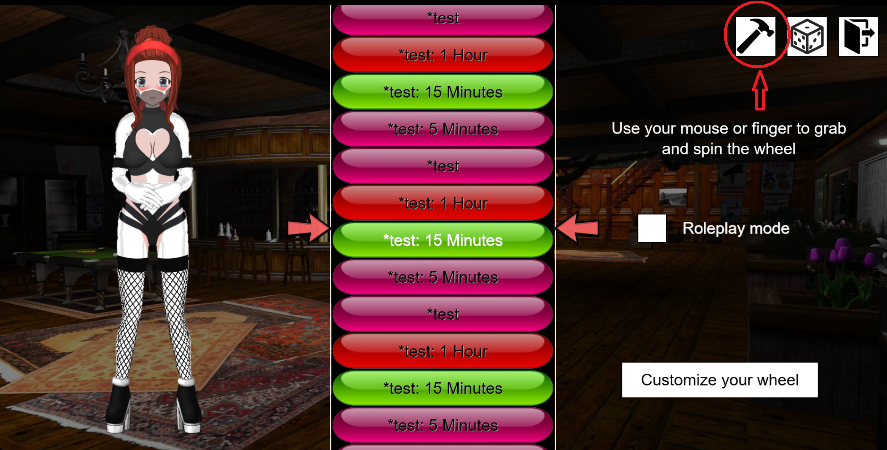

# Maid's Bondage Scripts
A repo with a number of Bondage Club-related additions, including:
* More crafting slots
* Additional bondage-heavy outfits for the wheel of fortune, including the likes of:
  * PSO (Permanently Sealed Object) uniforms
  * Bondage maids
  * Wrapped up mummies
  * Petrified statue
* Backports of a number of BC bug fixes (subject to change based on the particular release cycle)
* A new screen showing all items added in the current BC version
* The ability to create custom wheel of fortune outfits that can be used by you and anyone else using MBS:


## Installation
There are a number of (mutually exclusive!) options to install MBS these days:
* Recommended: Install the [FUSAM](https://sidiousious.gitlab.io/bc-addon-loader/) BC Addon Manager and use that to enable MBS
* Install the [FBC](https://sidiousious.gitlab.io/bce/) addon and enable MBS from inside the BC preference menu under `FBC Settings` -> `Other Addons`
* Install the Tampermonkey addon for your browser of choice and click on the MBS [loader.user.js](https://github.com/bananarama92/MBS/raw/main/src/loader.user.js) file
* Assigning (and activating) the following link to a bookmark or directly using it in the address bar:

```js
javascript:(()=>{fetch(`https://bananarama92.github.io/MBS/main/mbs.js?_=${Date.now()}`).then(r=>r.text()).then(r=>eval(r));})();
```

## Public API
MBS exposes a small public [API](api#readme) that can be used by other addons. See the accompanying typescript declaration file for more details.
