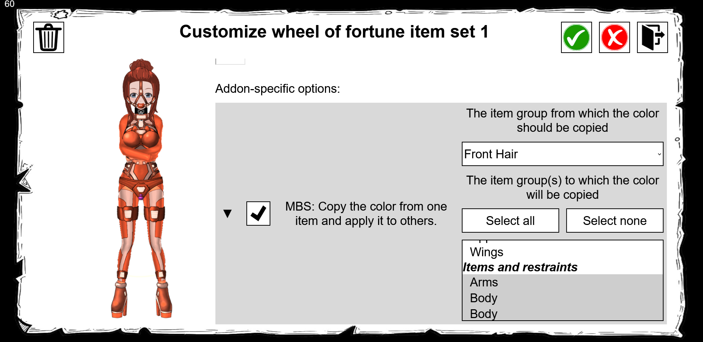

# MBS API

If MBS is installed then it exposes a small API accessible from `globalThis.mbs` (_i.e._ an `mbs` object in the global namespace). In order to safely use the API it is strongly recommended to place mbs access behind an `undefined` guard in case it isn't loaded. Note that checks against `API_VERSION.major`, while not strictly required, are recommended.

```js
if (typeof mbs !== "undefined" && mbs.API_VERSION.major === 1) {
    console.log(mbs.MBS_VERSION);
}
```

See the [`mbs.d.ts`](./mbs.d.ts) declarations file (which can be copy/pasted into the project of your choosing) for a full overview and documentation of the API.

## Wheel of fortune event listeners

Since MBS v1.8.0 it is possible for addons to register event listeners for the wheel of fortune, allowing addons to respond to and execute custom code in response to specific stages in the wheel of fortune spin. The wheel journey from event registration to the final wheel spin has 3 distinct steps:

1. An addon registers their custom event listener for a specific event. Such a registration includes:
    * The event-specific listener function itself (see `WheelEvents.Events` in the declarations file).
    * Some documentation-related information, both for internal use as well as the wheel spinner/user.
    * Optionally, the ability for the wheel spinner/user to configure the listener, the limits of such configuration being fully configurable during registration (see `WheelEvents.KwargsConfig` in the declarations file).

2. The wheel option is configured. The wheel owner at this stage has to enable the custom event listener, and, if so desired or required, configure it to their desire:


3. The wheel is spun. At this point the custom event listener is executed _if_ the spinner also has the relevant addon installed, with the configured parameters passed along to the listener in addition to the event itself (see `WheelEvents.Kwargs` in the declarations file).

## Wheel event listener examples

```ts
import bcModSdk from "bondage-club-mod-sdk";

const modName = "TST";
bcModSdk.registerMod({
    name: modName,
    fullName: "My test mod",
    version: "1.0.0",
});

mbs.wheelEvents.addEventListener(
    "beforeItemEquip",
    modName,
    {
        listener(ev, kwargs) {
            const difficulty = kwargs.difficulty;
            if (difficulty?.type === "number") {
                ev.difficultyModifier += difficulty.value;
            }
        },
        hookName: "myDifficultyHook",
        label: "Increase the difficulty of the equipped item(s)",
        kwargs: {
            difficulty: {
                label: "The increase in difficulty",
                type: "number",
                default: 5,
                min: 0,
                max: 10,
            },
        },
    },
);

mbs.wheelEvents.addEventListener(
    "beforeItemEquip",
    modName,
    {
        listener(ev, kwargs) {
            const color = kwargs.color;
            if (color?.type === "select" && color.value !== undefined) {
                ev.color.fill(color.value);
            }
        },
        hookName: "myRGBHook",
        label: "Color all items either red, green or blue",
        kwargs: {
            color: {
                type: "select",
                label: "The to-be applied color",
                options: [
                    { label: "Red", value: "#FF0000" },
                    { label: "Green", value: "#00FF00" },
                    { label: "Blue", value: "#0000FF" },
                ],
            },
        },
    },
);

mbs.wheelEvents.addEventListener(
    "validateItemEquip",
    modName,
    {
        listener(ev, kwargs) {
            if (ev.newAsset.Name.includes("Cheese")) {
                return `Asset ${ev.newAsset.Name} contains the term "Cheese"`;
            } else {
                return null;
            }
        },
        hookName: "myAntiCheeseHook",
        label: 'Ignore all to-be equipped items if their name contains the term "Cheese"',
    },
);

mbs.wheelEvents.addEventListener(
    "afterOutfitEquip",
    modName,
    {
        listener(ev, kwargs) {
            ChatRoomSendLocal("Hello world!");
        },
        hookName: "helloWorld",
        label: 'Show a "Hello world!" message in chat after equipping the outfit',
        description: [
            "Note that the message is only shown locally to yourself; ",
            "no one else in the room will be able to see it",
        ],
    },
);
```
